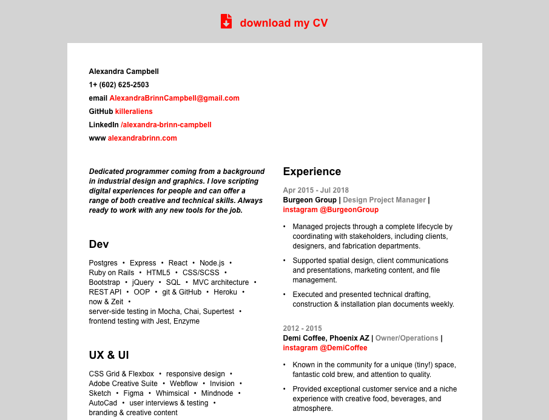
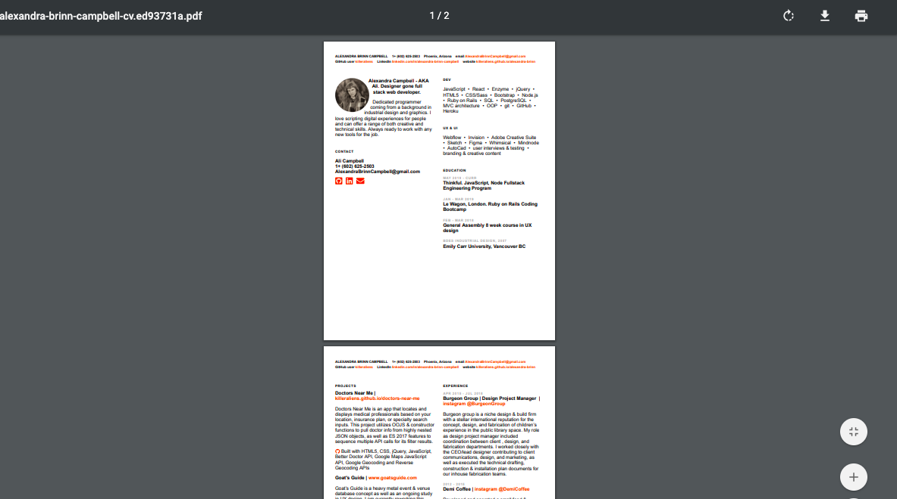

# CV of Alexandra Brinn Campbell

I am a designer gone fullstack web developer and this is my resume.
Created with React and Pupeteer. See instructions below if you are a developer and would like to use this as a template for your own CV.
[https://killeraliens.github.io/abc-cv](https://killeraliens.github.io/abc-cv/)

## Screenshots & Usage

### Live Version
View my CV. Download it! Formatted for mobile viewing too.
[Alexandra Brinn Campbell's CV](https://killeraliens.github.io/abc-cv/)

Deployed resume in desktop format.
<kbd>
  
</kbd>

Deployed resume in mobile format.

  <kbd>
    
  </kbd>

Downloadable PDF format created.
<kbd>
  
</kbd>

### For Developers
Use as a template for your own print and web CV.

1. To copy my template clone this repo with `git clone git@github.com:killeraliens/abc-cv.git`.
2. Install dependencies with `npm install`.
4. Start the dev server with `npm start`
3. Make content changes to the `/src/store.js`.
4. Update your pdf name and project path within the `/scripts/generate-pdf.js` file.
6. Update the `website` url from within your `/package.json` file if you wish to deploy with GitHub Pages.
5. Make sure class `live` is removed from the `/components/App.js` component before generating the PDF.
6. Create or update the downloadable PDF version with `npm run generate`. The new PDF format will be based on the sites' current HTML & CSS file state as a single 8.5" x 11" page.
7. Add class `live` back to `/components/App.js` for production mode formatting and commit your changes to your github repo before deployment.
8. Deploy with `npm run deploy`.

## Built With

* React
* Puppeteer
* Node.js with Babel
* GitHub Pages
