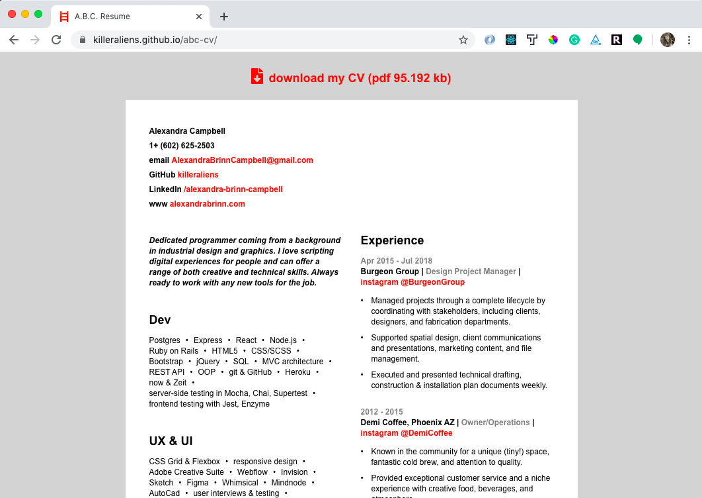
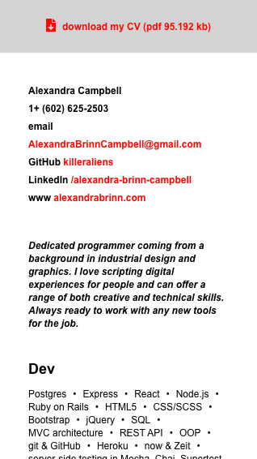
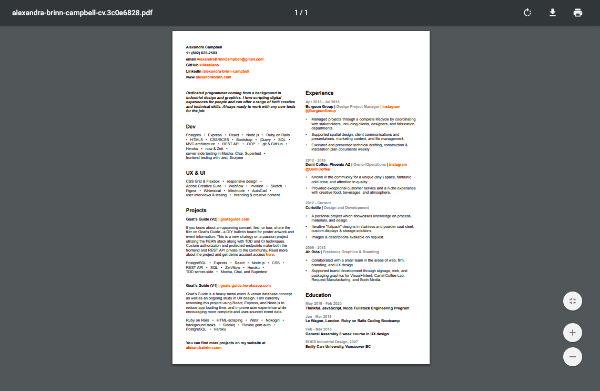

# ABC CV Template

An 8.5" x 11" PDF resume generator that you can also deploy on the web. Download the generated PDF from the live site.

[https://killeraliens.github.io/abc-cv](https://killeraliens.github.io/abc-cv/)

<!-- ## Screenshots & Usage -->

<!-- ### Live Version
View my CV. Download it! Formatted for mobile viewing too.
[Template CV](https://killeraliens.github.io/abc-cv/)

Deployed resume in desktop format.

  <kbd>
    
  </kbd>

 
Deployed resume in mobile format.

  <kbd>
    
  </kbd>

 
Downloadable PDF format created.

  <kbd>
    
  </kbd>

  -->

### For Developers
Use as a template for your own print and web CVs.

1. To copy my template clone this repo with `git clone git@github.com:killeraliens/abc-cv.git`.
2. Install dependencies with `npm install`.
3. Make content changes to the `/src/store.js`.
4. Make content changes to the AboutSection inside `/components/App.js`.
5. Commit the changes to your own github repo if you wish to deploy with GitHub Pages.
6. Update the deploy url from within your `/package.json` file. website: `https://your-handle.github.io/your-repo-name/`.
7. Update your pdf name and project path within the `/scripts/generate-pdf.js` file.
8. Start the dev server with `npm start`
9. Create or update the downloadable PDF file with `npm run generate`. The new PDF format will be based on the sites' current HTML & CSS file state as a single 8.5" x 11" page.
10. Update the `cvPdf` path with your new PDF file name inside `/components/App.js`.
11. Deploy with `npm run deploy`.

## Built With

* React
* Puppeteer
* Node.js with Babel
* GitHub Pages
